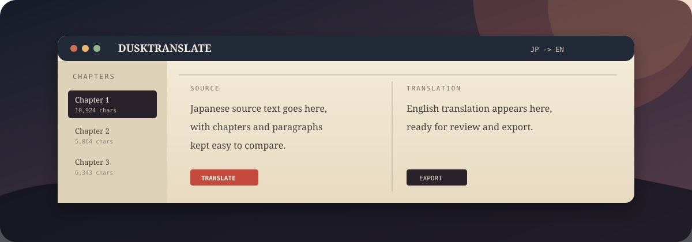

# DuskTranslate

> A focused, chapter-by-chapter workspace for translating Japanese light novels into readable English.

## What It Does

DuskTranslate is a self-contained browser app designed for long-form translation work. It keeps the source text and generated English side by side while making chapter navigation and repeated terminology easier to manage.

- Chapter-by-chapter source and translation panes
- Glossary support for names, terms, and preferred wording
- AI Studio and OpenRouter provider support
- TXT and EPUB import/export workflows
- Light and Eclipse themes
- Optional developer logging for troubleshooting model behavior
- No build system or local server required

## Try It

Try the [hosted project library](https://dusk-translate.vercel.app). It saves books, translations, glossary terms, and your current chapter in this browser. You can rename, archive, restore, back up, and resume projects. Provider API keys stay in the editor session.

The hosted application's login and private cloud library use Supabase. They need deployment configuration before accounts can be enabled; see [hosted setup](docs/HOSTED-SETUP.md). Until then, browser-local projects work without an account.

Download the [latest release](https://github.com/eye9444/Dusk-Translate/releases/latest), or open [`releases/current/DuskTranslate.html`](releases/current/DuskTranslate.html) directly from a local checkout.

The app runs in a modern browser. Enter your own provider API key in the app when prompted.

## Release Map

| Directory | Purpose |
| --- | --- |
| [`releases/current`](releases/current) | Preferred build for normal use |
| [`releases/development`](releases/development) | Active experiments and feature-test snapshots |
| [`releases/archive`](releases/archive) | Older builds kept for comparison and recovery |

Each HTML build is intentionally self-contained, making it easy to test a version without installing dependencies.

## Project Status

This is a personal workbench under active iteration. The current release is useful for hands-on translation, while development builds may change behavior or expose diagnostic controls.
