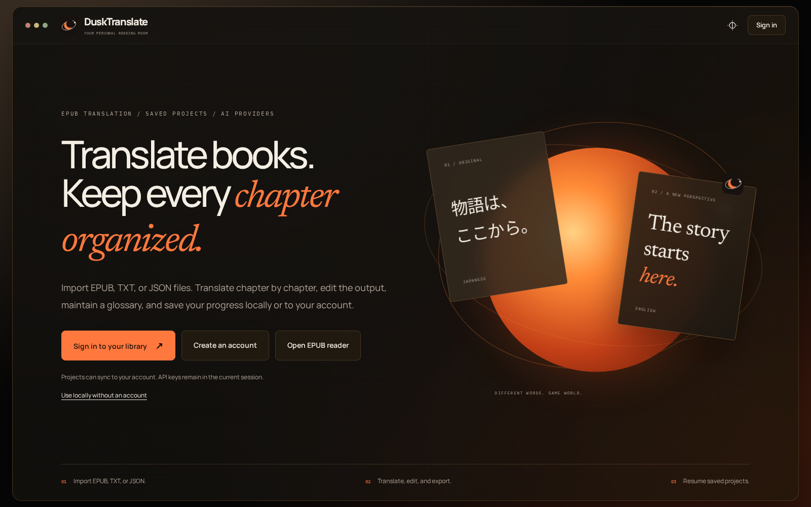
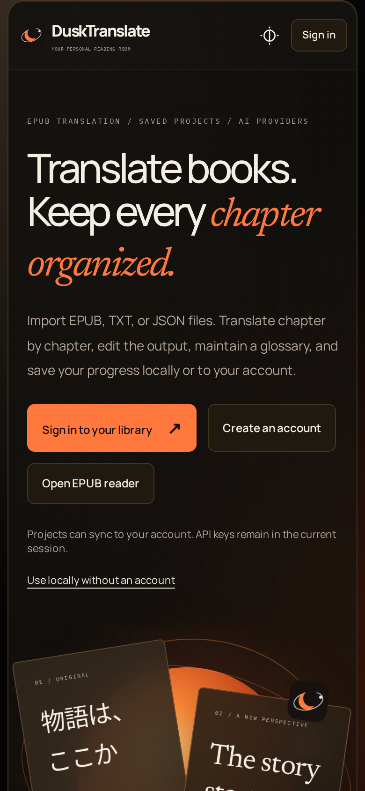

# DuskTranslate

<p align="center">
  <a href="https://dusk-translate.vercel.app">
    
  </a>
</p>

<p align="center">
  <strong>Translate EPUB books chapter by chapter, edit the result, and keep every project organized.</strong>
</p>

<p align="center">
  <a href="https://dusk-translate.vercel.app"></a>
  
  
</p>

## Open the Web App

**[Launch DuskTranslate](https://dusk-translate.vercel.app)** in a modern browser. No installation or downloaded HTML release is required.

You can use the local library without an account, or sign in with Google or email to maintain private cloud projects across sessions. Your AI-provider key is entered only when translating and remains in the current editor session rather than being stored with your account.

## Current Web Release

- Import EPUB, TXT, JSON project, and backup files
- Translate Japanese source text into English chapter by chapter
- Compare the source and editable translation side by side
- Maintain a project glossary for names and preferred terminology
- Save projects locally or sync them to a private signed-in library
- Rename, archive, restore, back up, and resume projects
- Read standalone EPUBs, source books, and completed translated books in the built-in reader
- Export translated work as TXT or EPUB
- Use Google AI Studio or OpenRouter models with your own API key
- Work on desktop or mobile in light or Eclipse themes

## Typical Workflow

1. Open the website and create a project from an EPUB, TXT, or saved project file.
2. Enter a Google AI Studio or OpenRouter API key in the translation workspace.
3. Translate one chapter at a time, edit the output, and maintain glossary terms as needed.
4. Return to the saved project later, read it in the built-in reader, or export the completed translation.

Need a provider key? The app links directly to its **[API key setup guide](https://dusk-translate.vercel.app/guides/api-keys.html)** from the translation workspace.

## Responsive Interface

The website is available on desktop and mobile. The intended way to use DuskTranslate is on a pc, however it can still be used with all its capabilities on mobile.

<p align="center">
  
</p>

## Run the Website Locally

```bash
npm ci
npm run dev
```

The development server prepares the embedded editor and starts Vite locally. Use these commands to verify a change before deployment:

```bash
npm test
npm run build
npm run test:e2e
npm run test:auth
```

Account and cloud-project features require Supabase environment variables. See **[Hosted Setup](docs/HOSTED-SETUP.md)** for the deployment configuration.

## Active Project Structure

- `web/` contains the hosted application, editor integration, EPUB reader, legal pages, and styles.
- `config/` contains Playwright configuration for browser and mocked-auth verification.
- `tests/` contains unit, browser, authentication, and row-level-security tests.
- `supabase/` contains the cloud-project schema and access policies.
- `scripts/` prepares and validates the web application.
- `docs/` contains architecture and deployment documentation.

## Legacy Standalone Builds

Historical HTML builds are retained on the **[`legacy-standalone` branch](https://github.com/eye9444/Dusk-Translate/tree/legacy-standalone/releases)** and in the [`v0.1.0` release](https://github.com/eye9444/Dusk-Translate/releases/tag/v0.1.0). They are no longer the primary product or recommended way to use DuskTranslate. The default branch now contains only the hosted application and its supporting files.

## Privacy and Security

DuskTranslate does not include advertising or behavioral analytics. Account storage is optional, cloud projects are protected per user, and provider API keys are not saved with project or account data.

- [Privacy Policy](https://dusk-translate.vercel.app/privacy.html)
- [Terms and Conditions](https://dusk-translate.vercel.app/terms.html)
- [Cookie Policy](https://dusk-translate.vercel.app/cookies.html)
- [Architecture](docs/ARCHITECTURE.md)

## Status

The hosted web release is under active development. The current focus is reliability across project saving, chapter translation, EPUB reading and export, authentication, and responsive use.
